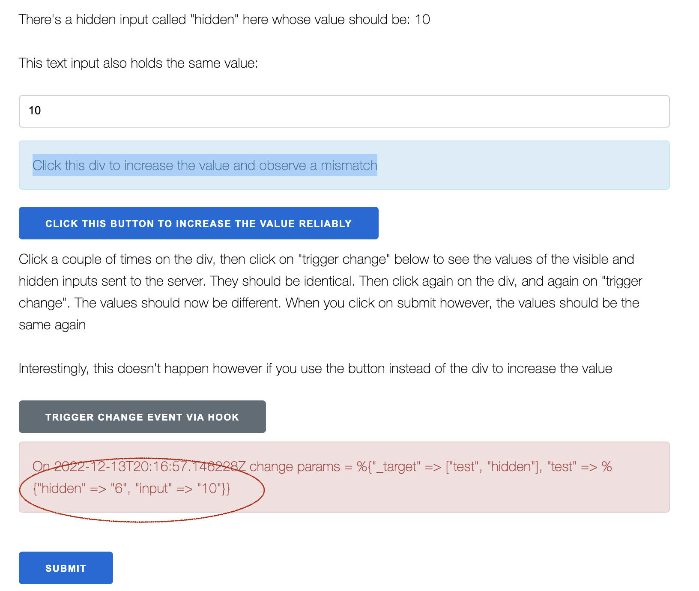
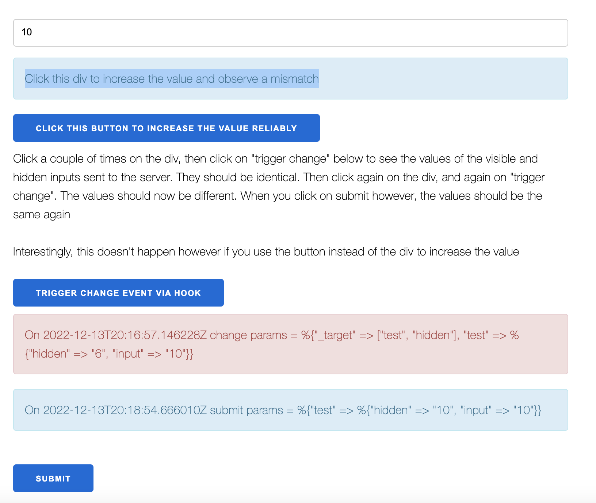

# Strange input update behavior

### How to run:

```
mix deps.get
mix phx.server
```

# Description

There's a hidden and a text input in a form, both bound the same assign called `value` (initially 0)

The value can be incremented by either clicking on a div or on a button.

There is also a button that triggers a change event on the form, by using a JS hook to dispatch an "input" event on the hidden input field:

```js
const hooks = {
    Test: {
        mounted() {
            this.handleEvent("trigger_change", () => {
                this.el.querySelector("input[type=hidden]").dispatchEvent(new Event('input', {bubbles: true}))
            })
        }
    }
}
```

If you click a few times on the div, and then trigger the change event, you'll see that the values of the 2 inputs (hidden and visible)
which are being sent to the server are identical, as expected.


However, if you then click again a few times on the div, and then trigger the change event again, you'll see that the hidden input has not been updated and has kept the value it had at the time of the last change event.



Clicking on the submit button always sends the expected (identical values) to the server .



Why do the hidden input and the visible input become out of sync when triggering the change event via JS?

(Interestingly enough, everything works as expected if the value is increased using a button and not a div)

